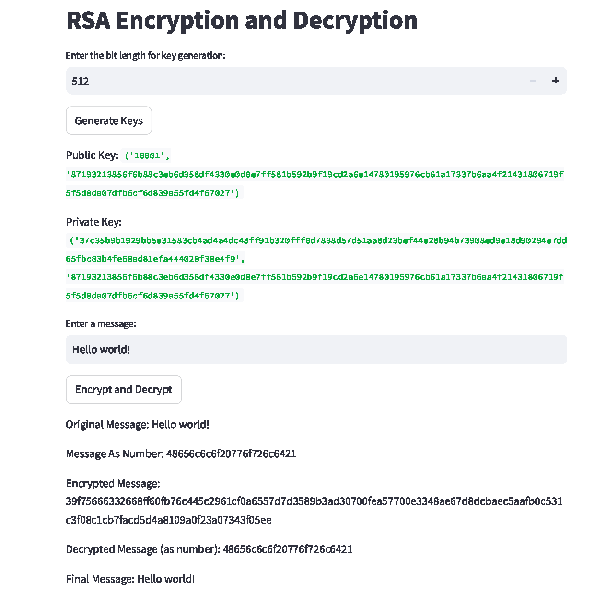

# Toy_RSA

This project implements RSA (Rivest–Shamir–Adleman) encryption and decryption algorithm in Python, along with a Streamlit web interface for easy interaction.

### Features

- RSA key generation with customizable bit length
- Message encryption and decryption
- Prime number generation using Miller-Rabin primality test
- Web interface using Streamlit

### Project Structure

- `rsa/`:
  
  - `keys_generation.py`: Functions for generating RSA keys
  - `primes.py`: Prime number generation and testing
  - `rsa_operations.py`: Core RSA encryption and decryption operations
  
    - Contains functions for pre-processing, encryption, decryption, and post-processing
    - Implements the RSA pipeline that ties all operations together
  - `utils.py`: Utility functions like quick exponentiation
- `tests/`
- `rsa_demo_app.py`: Streamlit web application


### How It Works

1. Generate RSA keys by specifying the desired bit length.
2. Enter a message to encrypt.
3. The system will encrypt the message using the public key, then decrypt it using the private key.
4. View the intermediate steps and final results.


### Installation

1. Clone this repository:
```
git clone https://github.com/ANKer661/Toy_RSA.git
cd Toy_RSA
```

2. Install the required dependencies:
```
pip install streamlit
```

3. Run the Streamlit app:
```
streamlit run app.py
```


### Online Demo

Try out Toy-RSA online without any installation. 

Visit this Streamlit app: [Toy-RSA Demo](https://anker661-toy-rsa-rsa-demo-app-isyesw.streamlit.app/)

Here's a screenshot of the demo:


### License
This project is licensed under the MIT License - see the LICENSE file for details.